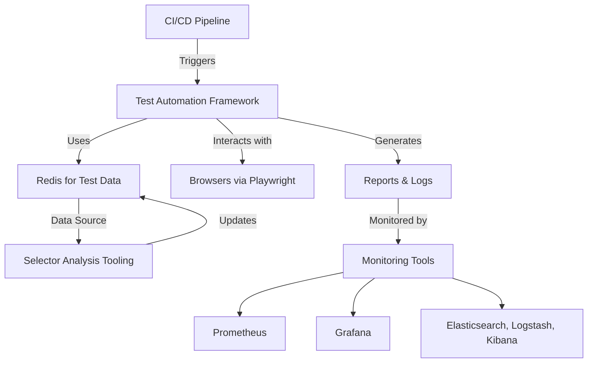
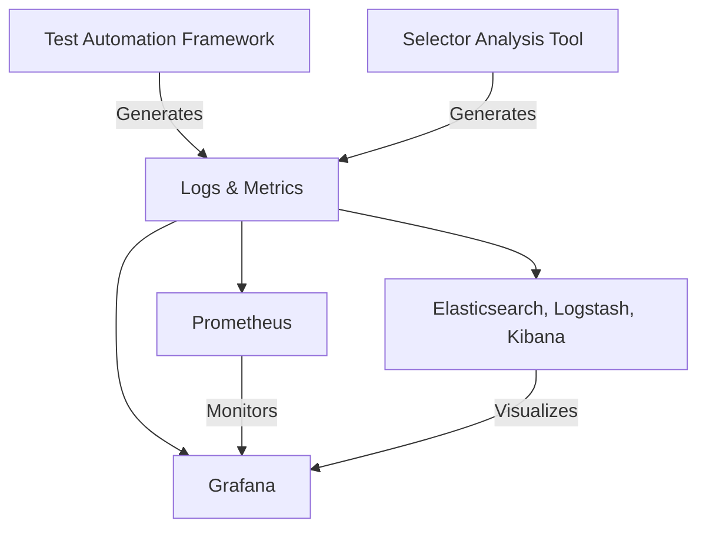
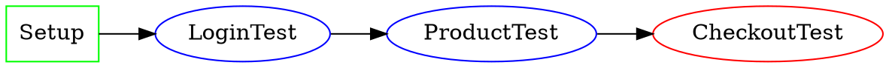

# Исследование решений для создания системы тестов приложений

## Обзор

Данное исследование представляет современные решения для создания комплексной системы тестирования, включающей:
- Визуальный интерфейс для тестирования
- Внутренние тесты через командные параметры  
- UI-тесты для Windows приложений
- Архитектуру на основе графов и метрик

## 1. Решения для UI-тестирования на Windows

### 1.1 Современные AI-driven решения

#### AskUI
- **Описание**: AI-powered платформа для автоматизации UI с использованием компьютерного зрения
- **Особенности**:
  - Поддержка Windows, macOS, Linux
  - Автоматизация через естественный язык
  - Не требует automation ID или DOM селекторов
  - Работает с enterprise приложениями (SAP, ServiceNow, Citrix)
- **Преимущества**: 
  - Кроссплатформенность
  - AI-driven идентификация элементов
  - Простота использования
- **Недостатки**: 
  - Новый инструмент, требует обучения
  - Зависимость от точности визуального распознавания

#### TestResults.io
- **Описание**: Платформа автономного тестирования с нулевой flaky-ностью
- **Особенности**:
  - Автоматизация через промпты на естественном языке
  - Поведенческая психология для распознавания элементов
  - Интеграция с CI/CD пайплайнами
- **Преимущества**: 
  - Высокая точность GenAI автоматизации
  - Контекстуальная идентификация элементов
- **Недостатки**: 
  - Коммерческое решение
  - Ограниченная информация о технических деталях

### 1.2 Традиционные и проверенные решения

#### Playwright
- **Описание**: Microsoft-разработанный фреймворк для end-to-end тестирования
- **Особенности**:
  - Кроссбраузерная поддержка (Chromium, Firefox, WebKit)
  - Поддержка WebView2 для Windows приложений
  - Автоматическое ожидание элементов
  - Встроенная отладка и трейсинг
- **Преимущества**: 
  - Стабильность и надежность
  - Активная поддержка Microsoft
  - Мощные инструменты отладки
- **Недостатки**: 
  - Ограниченная поддержка desktop приложений

#### PyAutoGUI (Python)
- **Описание**: Python библиотека для автоматизации GUI через симуляцию мыши и клавиатуры
- **Особенности**:
  - Поддержка Windows, macOS, Linux
  - Распознавание изображений через OpenCV
  - Простой Python API
  - Встроенные safety features
- **Преимущества**: 
  - Простота использования
  - Кроссплатформенность
  - Активное сообщество
- **Недостатки**: 
  - Ненадежность image-based автоматизации
  - Может быть обнаружен играми/приложениями

#### WinAppDriver (Microsoft)
- **Описание**: Официальный драйвер Microsoft для автоматизации Windows приложений
- **Особенности**:
  - Selenium-подобный API
  - Поддержка UWP, WinForms, WPF, Win32
  - Интеграция с Appium
- **Преимущества**: 
  - Официальная поддержка Microsoft
  - Знакомый WebDriver API
- **Недостатки**: 
  - ⚠️ Разработка приостановлена Microsoft
  - Ограниченные обновления

### 1.3 Коммерческие решения

#### Ranorex Studio
- **Описание**: Коммерческая платформа для автоматизации тестирования
- **Особенности**:
  - Поддержка desktop, web, mobile
  - Low-code/no-code подход
  - Продвинутое распознавание объектов
- **Преимущества**: 
  - Профессиональное качество
  - Комплексная поддержка
- **Недостатки**: 
  - Высокая стоимость
  - Vendor lock-in

#### TestComplete (SmartBear)
- **Описание**: Гибкая автоматизация для любых приложений
- **Особенности**:
  - Поддержка множества технологий
  - AI-powered visual testing
  - Самоисцеляющиеся тесты
- **Преимущества**: 
  - Всесторонняя поддержка приложений
  - HaloAI интеграция
- **Недостатки**: 
  - Коммерческая лицензия
  - Сложность настройки

### 1.4 Open Source альтернативы

#### FlaUI (.NET)
- **Описание**: .NET библиотека для автоматизации Windows UI
- **Особенности**:
  - Поддержка UIA2 и UIA3
  - Современная кодовая база
  - Замена устаревшего White Framework
- **Преимущества**: 
  - Специализация на Windows
  - Активное развитие
- **Недостатки**: 
  - Только C# поддержка
  - Требует дополнительных расширений

#### AutoIt
- **Описание**: BASIC-подобный скриптовый язык для Windows автоматизации
- **Особенности**:
  - Симуляция пользовательских действий
  - Компиляция в исполняемые файлы
  - Встроенный редактор
- **Преимущества**: 
  - Простой синтаксис
  - Freeware
- **Недостатки**: 
  - Не поддерживает Java
  - Ограничен Windows

## 2. Архитектура системы тестирования

### 2.1 Паттерны проектирования тестов

#### Page Object Model (POM)
```typescript
class ProductPage extends Page {
    get addToCartButton() {
        return $("#add-to-cart-button");
    }
    
    async clickAddProductToCart() {
        await this.addToCartButton.click();
    }
}
```

#### Screenplay Pattern
```typescript
export class Shopper {
    static addsProductToCart() {
        return actorInTheSpotlight().attemptsTo(
            Ensure.that(Text.of(ProductPage.productName), equals('Product Name')),
            Click.on(ProductPage.addToCartButton)
        );
    }
}
```

### 2.2 Современная архитектура фреймворка

#### AuroraFlow - AI-Driven Test Automation Framework


**Компоненты архитектуры**:
- **Node.js и TypeScript**: Основа фреймворка
- **Playwright**: Браузерная автоматизация
- **Redis**: Централизованное хранение данных тестов
- **AI-Driven SAT**: Динамическая идентификация селекторов
- **Docker Compose/Swarm**: Оркестрация контейнеров
- **Мониторинг**: Prometheus, Grafana, ELK stack

### 2.3 Иерархическая структура тестов

```
📁 tests/
├── 📁 web/
│   ├── 📁 login/
│   │   └── 📄 loginTest.js
│   └── 📁 cart/
│       └── 📄 addToCartTest.js
├── 📁 mobile/
│   ├── 📁 login/
│   │   └── 📄 mobileLoginTest.js
│   └── 📁 cart/
│       └── 📄 mobileAddToCartTest.js
├── 📁 pages/
│   ├── 📄 loginPage.js
│   └── 📄 productPage.js
├── 📁 utilities/
│   └── 📄 helpers.js
└── 📁 reports/
    └── 📄 testResults.html
```

## 3. Командные параметры и внутренние тесты

### 3.1 Robot Framework CLI опции

#### Выполнение тестов по тегам
```bash
# Включить тесты с определенным тегом
robot --include smoke_test .

# Исключить тесты с тегом
robot --exclude slow_test .

# Комбинированные условия
robot --include "smoke AND NOT slow" .
```

#### Выполнение по именам тестов
```bash
# Выполнить конкретный тест
robot --test "Login Test" .

# Выполнить тесты по паттерну
robot --test "*login*" .
```

#### Выполнение по сьютам
```bash
# Выполнить конкретную сьюту
robot --suite "Authentication Tests" .

# Выполнить несколько сьют
robot --suite "Login Tests" --suite "Registration Tests" .
```

#### Повторное выполнение неудачных тестов
```bash
# Повторить только неудачные тесты
robot --rerunfailed output.xml .

# Повторить сьюты с неудачными тестами
robot --rerunfailedsuites output.xml .
```

### 3.2 Pytest командные параметры

#### Базовые опции выполнения
```bash
# Выполнить тесты в модуле
pytest test_mod.py

# Выполнить тесты в директории
pytest testing/

# Выполнить по keyword expressions
pytest -k 'MyClass and not method'

# Выполнить конкретный тест
pytest tests/test_mod.py::test_func

# Выполнить по маркерам
pytest -m slow
```

#### Расширенные опции
```bash
# Показать самые медленные тесты
pytest --durations=10 --durations-min=1.0

# Собрать тесты без выполнения
pytest --collect-only

# Остановиться на первой ошибке
pytest -x

# Показать локальные переменные в traceback
pytest -l
```

#### Пользовательские конфигурации (ROAST Framework)
```bash
# Переопределить переменные
pytest --override my_version=2020.1

# Использовать машинную конфигурацию
pytest --machine zynq

# Включить рандомизацию
pytest --randomize
```

### 3.3 Тестирование CLI приложений в pytest

```python
def test_arguments_from_cli(mocker):
    """Тест аргументов командной строки."""
    mocker.patch(
        "sys.argv",
        [
            "app-test",
            "--host", "localhost",
            "--port", "8080",
            "--verbose"
        ],
    )
    app = MyApp()
    
    assert app.args.host == "localhost"
    assert app.args.port == 8080
    assert app.args.verbose is True
```

## 4. Метрики и библиотеки графов

### 4.1 Архитектура мониторинга



### 4.2 Метрики тестирования

#### Ключевые метрики:
- **Test Coverage**: Покрытие кода тестами
- **Pass/Fail Rate**: Коэффициент успешности тестов
- **Execution Time**: Время выполнения тестов
- **Flaky Test Detection**: Обнаружение нестабильных тестов
- **Environment Health**: Состояние тестовой среды

#### Инструменты визуализации:
- **Grafana**: Дашборды для метрик в реальном времени
- **Prometheus**: Сбор и хранение метрик
- **ELK Stack**: Анализ логов и поиск
- **ExtentReports**: Детальные отчеты о тестах

### 4.3 Библиотеки для работы с графами

#### NetworkX (Python)
```python
import networkx as nx
import matplotlib.pyplot as plt

# Создание графа зависимостей тестов
G = nx.DiGraph()
G.add_edge("Setup", "Login Test")
G.add_edge("Login Test", "Product Test")
G.add_edge("Product Test", "Checkout Test")

# Визуализация
pos = nx.spring_layout(G)
nx.draw(G, pos, with_labels=True)
plt.show()
```

#### Graphviz


## 5. Рекомендации по реализации

### 5.1 Выбор технологического стека

#### Для Windows Desktop приложений:
1. **Первоочередные варианты**:
   - AskUI (для современных AI-driven подходов)
   - Playwright + WebView2 (для web-based приложений)
   - FlaUI (для .NET приложений)

2. **Альтернативные варианты**:
   - PyAutoGUI (для простых сценариев)
   - AutoIt (для legacy приложений)

3. **Избегать**:
   - WinAppDriver (разработка приостановлена)

#### Для архитектуры фреймворка:
1. **Языки**: TypeScript/JavaScript, Python, C#
2. **Контейнеризация**: Docker Compose/Swarm
3. **Хранение данных**: Redis для кэширования, PostgreSQL для постоянного хранения
4. **Мониторинг**: Prometheus + Grafana + ELK
5. **CI/CD**: Jenkins, GitHub Actions, GitLab CI

### 5.2 Этапы внедрения

#### Этап 1: Прототип (2-4 недели)
- Выбор основного инструмента UI автоматизации
- Создание базовой структуры проекта
- Реализация простых тест-кейсов
- Настройка CI/CD пайплайна

#### Этап 2: Основная реализация (6-8 недель)
- Развертывание архитектуры на основе графов
- Интеграция системы метрик
- Создание визуального интерфейса для управления тестами
- Реализация командного интерфейса

#### Этап 3: Оптимизация (4-6 недель)
- Внедрение AI-driven элементов
- Оптимизация производительности
- Расширение покрытия тестами
- Документирование и обучение команды

### 5.3 Архитектурные принципы

#### SOLID принципы в тестировании:
- **Single Responsibility**: Каждый тест отвечает за одну функциональность
- **Open/Closed**: Тесты открыты для расширения, закрыты для модификации
- **Liskov Substitution**: Подклассы должны заменять базовые классы
- **Interface Segregation**: Создание специфичных интерфейсов
- **Dependency Inversion**: Зависимость от абстракций, а не от конкретных реализаций

#### Паттерны проектирования:
- **Page Object Model**: Инкапсуляция UI элементов
- **Factory Pattern**: Создание объектов тестовых данных
- **Builder Pattern**: Построение сложных тестовых сценариев
- **Observer Pattern**: Уведомления о результатах тестов

## 6. Заключение

Современная система тестирования должна объединять:

1. **Мощные инструменты автоматизации** с поддержкой AI и машинного обучения
2. **Гибкую архитектуру** на основе микросервисов и контейнеров
3. **Комплексную систему мониторинга** с визуализацией метрик
4. **Удобные интерфейсы** как графические, так и командной строки
5. **Масштабируемость и надежность** для enterprise-применения

Выбор конкретных инструментов должен основываться на:
- Типе тестируемых приложений
- Техническом опыте команды  
- Бюджетных ограничениях
- Требованиях к интеграции с существующими системами

Инвестиции в современную архитектуру тестирования окупаются через повышение качества продукта, сокращение времени выпуска релизов и снижение рисков в production среде.